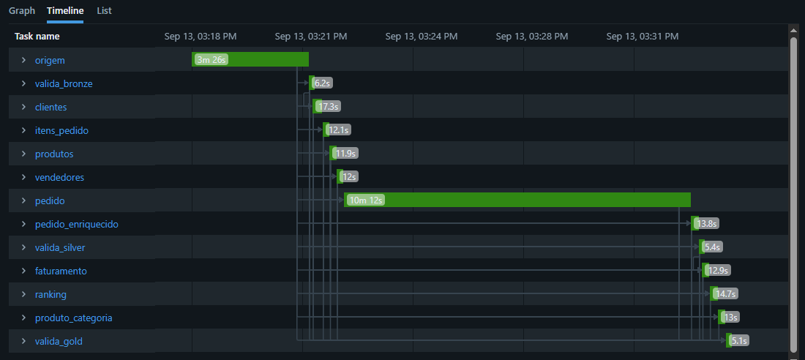

# Projeto Databricks - Lakehouse com Arquitetura Medallion


Projeto prático desenvolvido para resolver o desafio de Engenharia de Dados proposto pela comunidade Comunidados ( @gonzagadosdados). O objetivo foi construir um Lakehouse ponta a ponta no Databricks Community Edition utilizando o Arquitetura Medallion (Bronze, Silver e Gold) e orquestração via **Databricks Workflows**.

---

## 🏢 Contexto de Negócio

A **TechVenda** é um e-commerce de produtos eletrônicos e móveis que possui dados armazenados em um sistema legado em arquivos CSV. A missão do projeto é estruturar esses dados em uma plataforma moderna para responder a perguntas estratégicas.
segue perguntas para regra de negocio da empresa:

1. Qual o faturamento total por mês em 2024?
2. Quais vendedores geraram mais receita?
3. Quais são os produtos mais vendidos por categoria?
4. Qual a taxa de cancelamento de pedidos?

---

## 🏗️ Arquitetura do Projeto (Medallion Architecture)

A solução adota o padrão de **Arquitetura Medallion** no Lakehouse para garantir governança, qualidade incremental e desacoplamento no processamento de dados. Cada camada possui responsabilidade única e persiste as informações no formato **Delta Lake**, garantindo suporte a transações ACID.


```text
       ┌─────────────────────────────────────────────────────────────────┐
       │                         FONTES DE DADOS                         │
       │        5 Arquivos CSV Legados no DBFS (FileStore/desafio)       │
       └────────────────────────────────┬────────────────────────────────┘
                                        │
                                        ▼
       ┌─────────────────────────────────────────────────────────────────┐
       │                          CAMADA BRONZE                          │
       │   • Ingestão raw em formato Delta                               │
       │   • Zero regras de negócio ou transformações                    │
       │   • Preservação da linhagem e histórico exato da fonte          │
       └────────────────────────────────┬────────────────────────────────┘
                                        │
                                        ▼
       ┌─────────────────────────────────────────────────────────────────┐
       │                          CAMADA SILVER                          │
       │   • Limpeza e padronização de esquemas (DateType)               │
       │   • Filtros de qualidade (remoção de inativos e cancelados)     │
       │   • Enriquecimento, Joins relacionais e regras de negócio       │
       └────────────────────────────────┬────────────────────────────────┘
                                        │
                                        ▼
       ┌─────────────────────────────────────────────────────────────────┐
       │                           CAMADA GOLD                           │
       │   • Modelagem analítica agregada (Faturamento, Vendedores, Top, │
       |    taxa de cancelamento)                                        |
       │   • Aplicação de Window Functions (RANK)                        │
       │   • Tabelas prontas para consumo de BI e tomadores de decisão   │
       └─────────────────────────────────────────────────────────────────┘

```

## 📂 Dados de Origem

Os dados originais foram carregados no DBFS (`dbfs:/FileStore/desafio/`):

* `clientes.csv` (25 registros)
* `produtos.csv` (20 registros)
* `vendedores.csv` (8 registros)
* `pedidos.csv` (200 registros)
* `itens_pedido.csv` (509 registros)

---

## 🛠️ Detalhamento da Implementação

### 1️⃣ Camada Bronze (`01_bronze.py`)
* Leitura dos arquivos CSV em `dbfs:/FileStore/desafio/`.
* Persistência dos dados brutos em formato Delta no caminho `dbfs:/delta/bronze/`.
* Exibição dos schemas (`printSchema()`) para validação dos dados originais.

### 2️⃣ Camada Silver (`02_silver.py`)
* Leitura das tabelas Delta da camada Bronze.
* Tratamento de tipos de dados (conversão de campos de data para `DateType`).
* Filtro de registros inativos (removendo `status = 'inativo'` em clientes, produtos e vendedores).
* Filtro de pedidos cancelados (`status_pedido != 'cancelado'`).
* Unificação dos dados (Joins entre `pedidos`, `itens_pedido`, `clientes`, `produtos` e `vendedores`).
* Cálculo da métrica: (valor total dos item, quantidade, preço unitario e desconto)
* Armazenamento do DataFrame enriquecido em `dbfs:/delta/silver/pedidos_enriquecidos`.

### 3️⃣ Camada Gold (`03_gold.py`)
Geração de 3 visões analíticas prontas para consumo:

* **Gold 1 — Faturamento Mensal (`delta/gold/faturamento_mensal`):**
  Agrupamento por ano e mês extraídos da data do pedido, calculando `total_pedidos` e `receita_total`.
* **Gold 2 — Ranking de Vendedores (`delta/gold/ranking_vendedores`):**
  Agrupamento por vendedor e região, calculando `total_pedidos`, `receita_gerada` e `ticket_medio`.
* **Gold 3 — Top Produtos por Categoria (`delta/gold/top_produtos_categoria`):**
  Uso de **Window Function** (`RANK() OVER (PARTITION BY categoria ORDER BY receita_produto DESC)`) para filtrar o Top 3 de cada categoria.

---

## 🔄 Orquestração (Databricks Workflows)

A execução ponta a ponta é automatizada através de um **Databricks Job**:

* **Dependências:** `02_silver` depende da conclusão com sucesso de `01_bronze`, e `03_gold` depende de `02_silver`.

---

## transação Jobs & Pipelines
Workflow_techvendda


## 📁 Estrutura do Repositório

```text
.
├── notebooks/
│   ├── 01_bronze.py
│   ├── 02_silver.py
│   └── 03_gold.py
├── screenshots/
│   ├── workflow_success.png
│   ├── gold_faturamento_mensal.png
│   ├── gold_ranking_vendedores.png
│   └── gold_top_produtos.png
└── README.md


